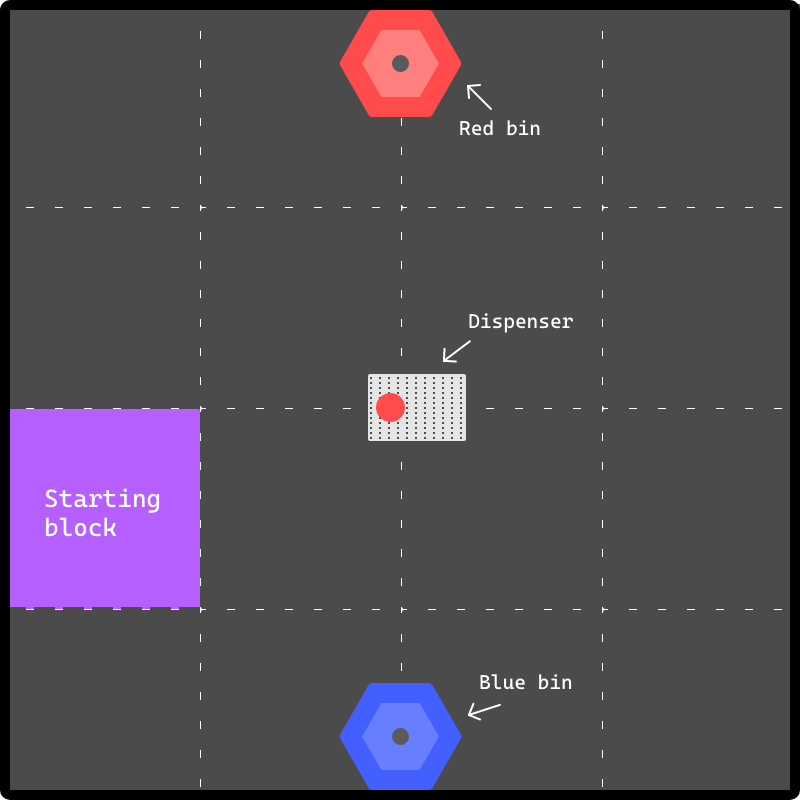
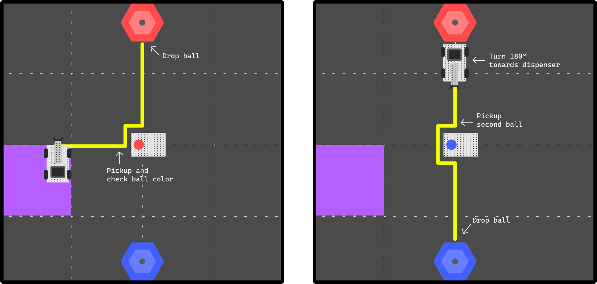
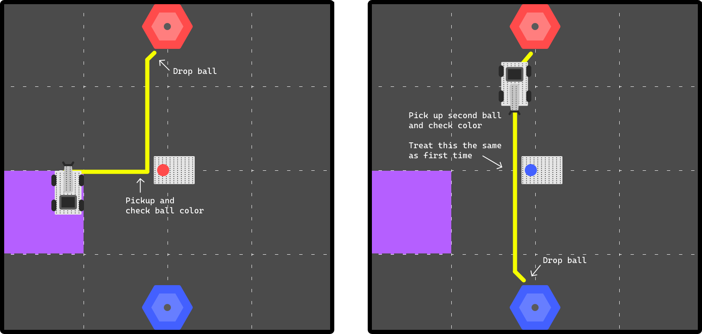
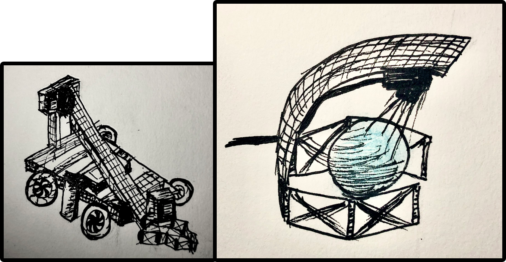

# Sensor Challenge

The third task and the first major task.
The goal is to program the robot to pick up two balls consecutively from a "dispenser,"
then, after detecting the ball's color,
drops the ball into the corresponding bin.
This is a picture of the setup:



The first condition of the task is that the robot must start in the left purple square.
Following this,
the first decision I made was to always start the robot in the top right corner of this purple square
by lining the robot up with the square's borders.

Not only is this spot the closest to the dispenser,
but I am also doing this because starting from a consistent position
lowers the chance of human-caused errors when setting up the robot
and allows for a more consistent code.

## Path

Now, it is time to consider the path of the robot.
Initially, the plan was to have the robot make several 90 degrees turns to reach the bin and back.
The reasoning is, when coming back, the robot will be directly facing the dispenser
and can therefore save some time by picking up the ball from the side of the dispenser
then going around it straight to the other bin.



However, I soon realized one overlooked factor:
the two balls are not necessarily always a different color;
both the first and second ball can be red, and both can be blue.

This discovery led to a complete redesign to a more efficient path.
The main idea is to make the robot return to the initial pickup spot
so that it can reuse the same code for both balls.



## Sensor

Now that we have finalized the path,
we can now consider the other major part of the task: the sensor.

In essence, there needs to be a sensor that can detect the color of the ball.
At first, I experimented with the VEX vision sensor.
After mounting it at the front of the robot and after a somewhat confusing setup process,
I was able to get the sensor to work.

However, despite it working as needed, as it is essentially a camera,
it also provided a lot of other unused information.
Because of the other information, retrieving the color alone was not very straightforward.

In my opinion, similar to code, a sensor should do one thing and do that one thing well.
In this case, the vision sensor was simply adding too much unneeded "fluff."
This led to me shifting to the VEX optical sensor;
this time,
the optical sensor was mounted directly above the claw to minimize other unnecessary information.
The optical sensor worked great and allowed for much easier and direct access to the color values.
The illustration below shows the robot and how the sensor is mounted.



## Code

The task is divided into four main functions:

- `initialPickup`,
  start from the purple square, then drive to the dispenser to pick up the ball.
- `getColor`, get the color of the ball.
- `toBin`, go to the bin and drop the ball.
- `secondPickup`,
  start from the bin and drive back to the dispenser to pick up the ball.

By connecting the functions,
the robot can essentially continue looping to sort a large number of balls.

A key part of my implementation is that
there are no separate functions for going to the red and blue bins;
they both use the `toBin` function.
Not only do I pass in the ball color there are also directions associated with the color.
For example, if the ball was red, the direction would be left;
this direction variable can then be used in a single turn statement.

At first, I passed in the directions along with the color.
However, it became quite cumbersome.
An object is likely the best solution here.
However, I used a global `struct` instance to store the color and directions:

```c++
struct ball_t
{
    color color;
    turnType turnDir1;
    turnType turnDir2;
};
```

## Problems

The biggest problem is the inaccuracy in the turning.
Unfortunately, because there is no gyro sensor,
the robot is unable to turn with complete accuracy.

As I have come to find out, many factors can affect turning: the floor hardness,
the cleanness of the wheel, and even sometimes the battery of the robot;
this creates a lot of uncertainty in the robot's turning,
creating somewhat inconsistency in the robot's path.

Largely because of this, despite numerous tests confirming that,
theoretically, my program should be able to complete the task every time,
at the moment of writing this, it has only fully completed the task twice.
However, even so, it has been a great accomplishment and an awesome and exciting journey!
Looking forward to the next challenge!
